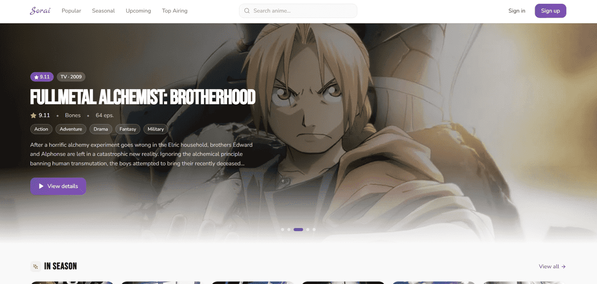

# Sorai — Your Personal Anime Tracker

A modern, full-stack web application to explore, search, and organize your personal anime list. Built with Next.js 14, Supabase, and the Jikan API.




---

## Features

### Browse & Discover
- **Hero Carousel** — Rotating spotlight of featured anime on the home page
- **Browse Categories** — Popular, Seasonal, Upcoming, Top Airing, Movies, OVAs, ONAs, Specials
- **Season Archives** — Browse anime by season and year (Winter, Spring, Summer, Fall)
- **Genre Filtering** — Action, Romance, Shounen, Sci-Fi, Fantasy, and more
- **Search** — Full-text search with pagination and estimated total count

### Anime Detail
- Full synopsis, trailer, characters with voice actors, and episode list
- **Related Anime** and **Similar Anime** carousels with progressive loading
- **Theme Songs** — Clickable openings/endings that search YouTube in a new tab
- Add to list, change status, rate with score (1–10)

### Personal Anime List
- **Grid view** and **List view** with status-based title hover colors
- Filter and search within your list
- Status management: Watching, Completed, On Hold, Dropped, Plan to Watch
- Score rating with interactive dropdowns

### User Settings
- Profile management: avatar upload/remove, username and email update
- Password change
- Sensitive content toggle (integrates with Jikan API `sfw` parameter)
- Data export (JSON) of your full anime list
- Account deactivation

### Performance & Reliability
- **Rate-Limited Fetch Queue** — Automatic request throttling (~3 req/s) prevents 429 errors from the Jikan API
- **API Caching** — `sessionStorage` caching layer with 10-minute TTL
- **Progressive Loading** — Skeleton states and `fetchSequential` with `onProgress` callbacks for incremental UI updates
- **Deduplication** — Overfetch + dedup logic ensures unique cards per page
- **Supabase Singleton** — Single client instance shared across the entire app via AuthContext
- **Suspense Boundaries** — Proper wrapping for `useSearchParams()` to pass Next.js build requirements

### Security
- **Row Level Security (RLS)** — Users can only access their own data
- **Input Validation** — Client-side validation for usernames, emails, passwords, search queries, and file uploads
- **XSS Protection** — All user-generated content is safely rendered
- **Session Validation** — Protected API routes verify authentication
- **Secure File Uploads** — MIME type, size, and extension checks for avatar uploads

---

## Tech Stack

| Technology | Purpose |
|---|---|
| [Next.js 14](https://nextjs.org/) (App Router) | React framework with hybrid rendering |
| [TypeScript](https://www.typescriptlang.org/) | Static type checking |
| [Tailwind CSS 3](https://tailwindcss.com/) | Utility-first styling with CSS custom properties |
| [Supabase](https://supabase.com/) | PostgreSQL database + Authentication + Storage |
| [Jikan API v4](https://jikan.moe/) | Anime data from MyAnimeList — no API key required |
| [Lucide React](https://lucide.dev/) | Icon library |
| [Sonner](https://sonner.emilkowal.dev/) | Toast notifications |

---

## Project Structure

```
src/
├── app/
│   ├── layout.tsx                  # Root layout (fonts, AuthProvider, Navbar, Footer, Toaster)
│   ├── page.tsx                    # Home — Hero carousel + Popular + Seasonal
│   ├── globals.css                 # CSS custom properties + Tailwind config
│   ├── browse/page.tsx             # Browse by category, genre, or season archive
│   ├── search/page.tsx             # Search with pagination & estimated results
│   ├── anime/[id]/page.tsx         # Anime detail (synopsis, trailer, characters, etc.)
│   ├── my-list/page.tsx            # Personal anime list (private route)
│   ├── settings/page.tsx           # User settings & account management
│   └── api/update-email/route.ts   # Server-side email update endpoint
│
├── components/
│   ├── Navbar.tsx                  # Navigation bar with search & user menu
│   ├── Footer.tsx                  # Site footer with quick links
│   ├── HeroCarousel.tsx            # Animated hero banner on home page
│   ├── AnimeCard.tsx               # Reusable anime card (with React.memo)
│   ├── AnimeCardSkeleton.tsx       # Skeleton loading placeholder
│   ├── AnimeGridSkeleton.tsx       # Grid of skeleton cards
│   ├── AnimeHorizontalCarousel.tsx # Horizontal scrollable carousel
│   ├── Pagination.tsx              # Reusable pagination with ellipsis
│   ├── AuthModal.tsx               # Auth modal shell (delegates to forms)
│   ├── LoginForm.tsx               # Login form component
│   ├── RegisterForm.tsx            # Registration form component
│   ├── DeleteConfirmModal.tsx      # Deletion confirmation dialog
│   ├── anime-detail/              # Anime detail sub-components
│   │   ├── AnimeHeroBanner.tsx     #   Hero section with poster & actions
│   │   ├── AnimeSynopsis.tsx       #   Synopsis section
│   │   ├── AnimeTrailer.tsx        #   YouTube trailer embed
│   │   ├── AnimeCharacters.tsx     #   Characters grid with VAs
│   │   ├── AnimeEpisodes.tsx       #   Episode list
│   │   └── AnimeInfoSidebar.tsx    #   Info card + theme songs
│   ├── my-list/                   # My-list sub-components
│   │   ├── GridCard.tsx            #   Card for grid view
│   │   └── ListCard.tsx            #   Card for list view with dropdowns
│   └── settings/                  # Settings sub-components
│       ├── ProfilePhotoSection.tsx  #   Avatar upload/remove
│       ├── AccountSection.tsx       #   Username & email management
│       ├── PasswordSection.tsx      #   Password change
│       ├── PreferencesSection.tsx   #   Sensitive content toggle
│       └── DangerZoneSection.tsx    #   Export data & deactivation
│
├── hooks/
│   ├── useAnimeDetail.ts           # Data fetching for anime detail page
│   └── useAnimeListActions.ts      # Add/update/remove anime list actions
│
├── constants/
│   ├── anime-status.ts             # Status labels, colors, and order
│   └── filters.ts                  # Type filters (TV, Movie, OVA, etc.)
│
├── context/
│   └── AuthContext.tsx              # Global auth provider (Supabase singleton)
│
├── lib/
│   ├── supabase.ts                 # Supabase client (lazy singleton)
│   ├── jikan.ts                    # Jikan API wrapper with cache & rate limiting
│   ├── mappers.ts                  # Data transformation (mapToCardData, dedup)
│   ├── rate-limit.ts               # API rate limit middleware
│   ├── user-anime-list.ts          # CRUD operations for user anime list
│   ├── user-profile.ts             # User profile management
│   └── validators.ts               # Input validation (search, auth, uploads)
│
├── types/
│   ├── anime.ts                    # App types (AnimeStatus, UserAnimeListItem)
│   └── jikan.ts                    # Jikan API response types
│
└── middleware.ts                   # Next.js middleware (session refresh)
```

---

## Getting Started

### Prerequisites

- **Node.js** 18 or higher
- **npm** (included with Node.js)
- A [Supabase](https://supabase.com) account (free tier works)

### 1. Clone and install

```bash
git clone https://github.com/erickdc7/sorai-app.git
cd sorai-app
npm install
```

### 2. Set up Supabase

#### 2.1 Create a project

1. Go to [app.supabase.com](https://app.supabase.com)
2. Create a new project (or use an existing one)
3. Wait for initialization to complete

#### 2.2 Run the database schema

1. In your Supabase dashboard, go to **SQL Editor**
2. Copy and paste the contents of `supabase/schema.sql`
3. Execute the query — this creates the required tables with RLS policies

#### 2.3 Disable email confirmation (Important)

> **⚠️ Without this step, registration won't work as expected.** Users will be created but won't be able to sign in until they confirm their email.

1. In Supabase, go to **Authentication** → **Providers** → **Email**
2. **Disable** the **"Confirm email"** option
3. Save changes

This allows users to register and sign in immediately without email verification.

#### 2.4 Get your API credentials

1. Go to **Settings** → **API** in your Supabase project
2. Copy:
   - **Project URL** → `NEXT_PUBLIC_SUPABASE_URL`
   - **anon public key** → `NEXT_PUBLIC_SUPABASE_ANON_KEY`

### 3. Configure environment variables

Create a `.env.local` file in the project root:

```env
NEXT_PUBLIC_SUPABASE_URL=https://your-project.supabase.co
NEXT_PUBLIC_SUPABASE_ANON_KEY=eyJhbGciOiJI...your_key_here
```

### 4. Run in development

```bash
npm run dev
```

The application will be available at **http://localhost:3000**

### 5. Production build (optional)

```bash
npm run build
npm start
```

---

## Pages

| Route | Access | Description |
|---|---|---|
| `/` | Public | Home — Hero carousel, popular anime, current season |
| `/browse?type=popular` | Public | Most popular anime of all time |
| `/browse?type=season` | Public | Currently airing anime |
| `/browse?type=upcoming` | Public | Upcoming anime |
| `/browse?type=airing` | Public | Top airing anime |
| `/browse?type=movies` | Public | Top rated anime movies |
| `/browse?type=ova` | Public | Original Video Animations |
| `/browse?type=ona` | Public | Original Net Animations |
| `/browse?type=special` | Public | Special episodes |
| `/browse?type=season-archive&year=2026&season=winter` | Public | Season archive |
| `/browse?genre=1` | Public | Browse by genre |
| `/search?q=term` | Public | Full-text search with pagination |
| `/anime/[id]` | Public | Anime detail page |
| `/my-list` | Private | User's personal anime list |
| `/settings` | Private | Account settings & preferences |

---

## Authentication

- **Register** with email, password, and username (with real-time validation)
- **Sign in** with email and password
- Private routes (`/my-list`, `/settings`) redirect to home if no session exists
- User avatar displays profile photo or initial of username
- Account deactivation prevents sign-in and immediately signs out

---

## External APIs

### Jikan API v4

| | |
|---|---|
| **Base URL** | `https://api.jikan.moe/v4` |
| **Authentication** | None (free public API) |
| **Rate Limit** | 3 req/s — handled with built-in rate-limiting fetch queue |

**Endpoints used:**

| Endpoint | Purpose |
|---|---|
| `/top/anime` | Popular and top airing anime |
| `/seasons/now` | Current season anime |
| `/seasons/upcoming` | Upcoming anime |
| `/seasons/{year}/{season}` | Season archives |
| `/anime?q=` | Full-text search |
| `/anime/{id}/full` | Complete anime details |
| `/anime/{id}/characters` | Character list with voice actors |
| `/anime/{id}/episodes` | Episode listing |
| `/anime/{id}/relations` | Related anime |
| `/anime/{id}/recommendations` | Similar anime recommendations |
| `/anime?genres={id}` | Browse by genre |

---

## Database

### `user_anime_list`

Stores the user's personal anime tracking data.

```sql
user_anime_list
├── id (UUID, PK)
├── user_id (UUID, FK → auth.users)
├── mal_id (INTEGER)
├── status (TEXT: watching | completed | paused | dropped | planned)
├── score (INTEGER, 1–10, nullable)
├── anime_title (TEXT)
├── anime_image_url (TEXT)
├── anime_year (INTEGER)
├── anime_type (TEXT)
└── created_at (TIMESTAMP)
```

### `user_profiles`

Stores user profile data and preferences.

```sql
user_profiles
├── id (UUID, PK, FK → auth.users)
├── username (TEXT)
├── avatar_url (TEXT, nullable)
├── show_sensitive_content (BOOLEAN, default false)
├── deactivated_at (TIMESTAMP, nullable)
├── created_at (TIMESTAMP)
└── updated_at (TIMESTAMP)
```

Row Level Security (RLS) ensures each user can only read and modify their own data.

---

## Architecture

### Component Composition

Pages are composed from focused, single-responsibility sub-components:

- **Anime Detail** — `AnimeHeroBanner` + `AnimeSynopsis` + `AnimeTrailer` + `AnimeCharacters` + `AnimeEpisodes` + `AnimeInfoSidebar`
- **Auth Modal** — `AuthModal` (shell) → `LoginForm` / `RegisterForm`
- **My List** — `GridCard` + `ListCard` (extracted from the page)
- **Settings** — `ProfilePhotoSection` + `AccountSection` + `PasswordSection` + `PreferencesSection` + `DangerZoneSection`

### Shared Layout

`Navbar`, `AuthModal`, and `Footer` are rendered once in `layout.tsx` — pages only define their unique content.

### Data Flow

```
AuthContext (Supabase singleton + user state)
    ├── Pages consume via useAuth()
    ├── Custom hooks encapsulate data fetching
    │   ├── useAnimeDetail — core + relations + recommendations
    │   └── useAnimeListActions — add / update / remove with optimistic updates
    └── lib/ handles API communication
        ├── jikan.ts — cached, rate-limited Jikan API calls
        ├── user-anime-list.ts — Supabase CRUD
        └── user-profile.ts — profile management
```

### Rate Limiting Strategy

The Jikan API allows ~3 requests per second. Sorai handles this with:

1. **`sessionStorage` cache** (10-min TTL) — avoids redundant requests entirely
2. **`rateLimitedFetch()`** — enforces a minimum 334ms gap between API calls
3. **`fetchSequential()`** — processes enrichment loops one-by-one with `onProgress` callbacks for progressive UI updates
4. **`getAnimeByIdThrottled()`** — rate-limited variant of `getAnimeById` for enrichment loops

---

## Design System

All colors are defined as CSS custom properties in `globals.css` for consistency and easy theming:

- **Primary palette** — Purple theme (`--color-primary`, `--color-primary-light`, etc.)
- **Status colors** — Watching (green), Completed (purple), On Hold (yellow), Dropped (red), Plan to Watch (blue)
- **Browse categories** — Each category has its own icon and background color token
- **Season icons** — Winter (❄️ sky), Spring (🌸 pink), Summer (☀️ amber), Fall (🍂 orange)
- **Typography** — Nunito Sans (body), Bebas Neue (headings), Marck Script (logo)

---

## Troubleshooting

| Problem | Solution |
|---|---|
| "Invalid supabaseUrl" | Check that `.env.local` has valid URLs (`https://...`) |
| Can't sign in after registering | Disable "Confirm email" in Supabase Authentication → Email |
| Images not loading | Check internet connection (images come from `cdn.myanimelist.net`) |
| 429 API error | Wait a few seconds and retry — the rate-limiting queue handles this automatically for most cases |
| Port 3000 in use | Next.js will automatically use 3001 |
| Build error with `useSearchParams` | Ensure components using it are wrapped in a `<Suspense>` boundary |
| Font override warning | `adjustFontFallback: false` is set for Nunito Sans |

---

## License

This project is for personal and educational use. Anime data is provided by the [Jikan API](https://jikan.moe/) (unofficial MyAnimeList API).
